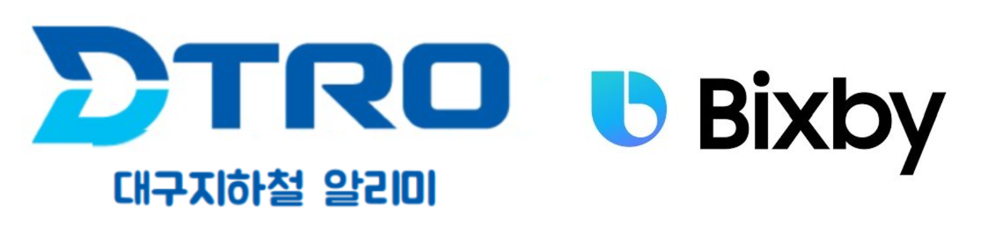
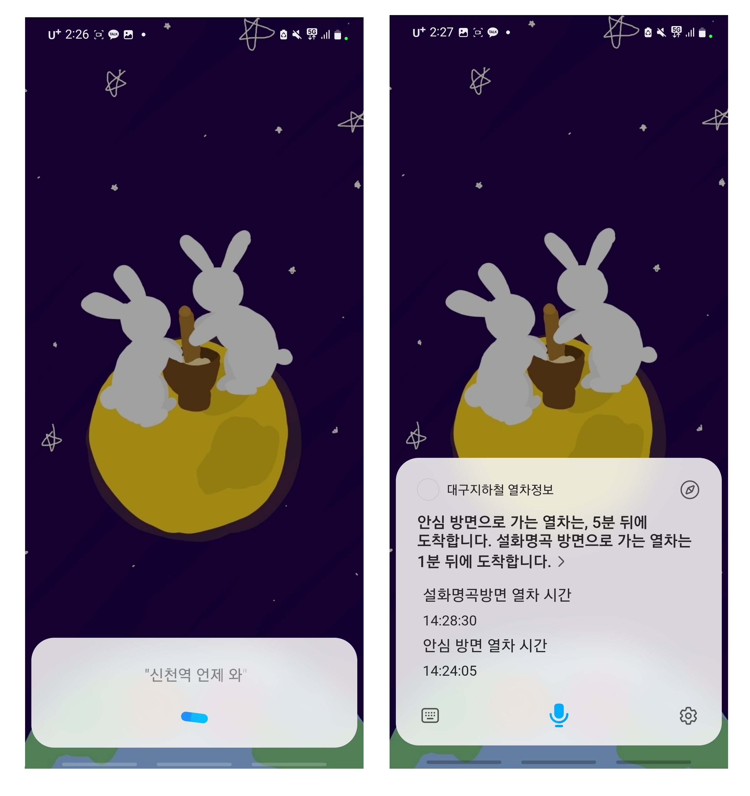
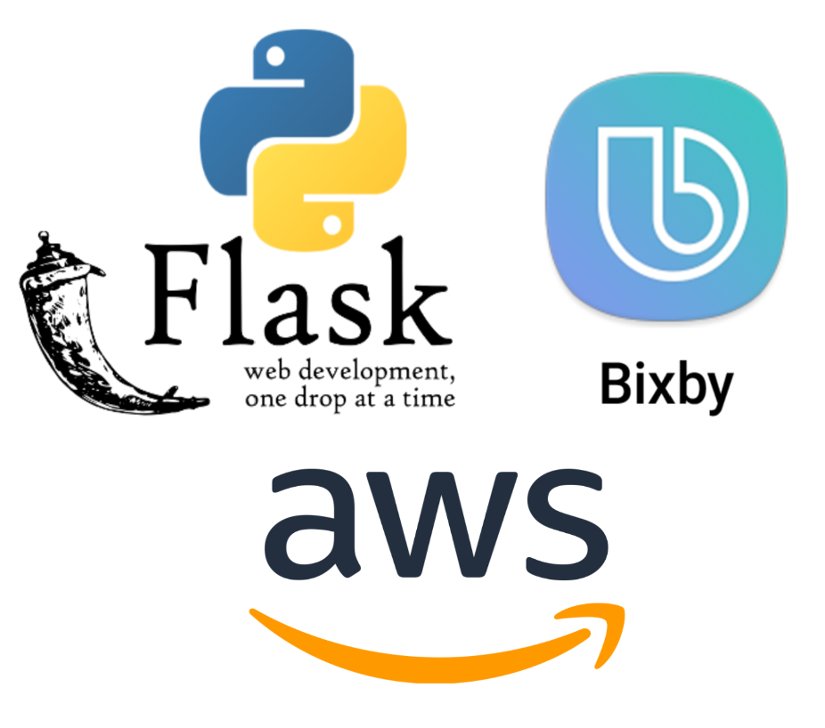

# 해커톤 보고서 - [자유 세션] 대구도시철도 열차정보 Bixby Application

- 팀명
  - 대프리카김밥천국
  
- 제출 세션 및 주제
  - 자유 세션 - 대구도시철도 열차 정보 알리미

- 프로젝트 한 줄 설명
  - 대구도시철도 열차 정보를 빅스비를 이용해 간단하게 확인 가능
  
  

- 프로젝트에 대한 설명
  - 저희는 알람을 맞추거나 날씨 정보를 확인할 때 "시리야", "하이 빅스비" 등 음성 인식 AI를 편하게 활용합니다.
  - 하지만 도시철도 도착 시간을 확인하기 위해서는 '지하철종결자', '대구도시철도 앱', '네이버 지도' 등 지하철 관련 어플리케이션을 실행해 일일이 검색해 봐야한다는 불편함이 있었습니다.
  - 저희는 이러한 불편함을 해결하기 위해 삼성 빅스비 AI 응용 서비스를 개발했습니다.
  - 이제는 빅스비를 통해, __대구 시민들은 대구도시철도 열차 정보에 대해서 쉽고 편하게 확인__ 할 수 있을 것입니다.
  - 빅스비 서비스 개발을 완료해, 현실에서 사용할 수 있도록 Public Submission 을 신청 한 상태입니다.
  - __Public Submission 승인까지 약 3~5일 정도가 예상__ 되며, 승인 이후에는 __실생활에서 대구 시민들이 "대구도시철도 열차 정보 알리미" 서비스를 만나볼 수 있을 것__ 입니다.
  - 실생활 사용 예시 : "하이 빅스비" + "대구지하철에서 중앙로역 설화명곡 방향 열차 언제 도착해?" , "대구지하철에서 신천역 열차 언제 도착해?", "대구지하철에서 대구은행역 첫차 시간 언제야?" 

- 프로젝트에 사용된 기술

  - 프론트 엔드(Front-End) 기술 : __Bixby Platform__
    - Node.JS 기반 JavaScript와 Bixby(.bxb) 언어를 활용하여, 빅스비를 통해 사용자와 서비스가 소통할 수 있게 함.
  - 백엔드(Back-End) 기술 : __Python Flask__, __Bixby AI__, __AWS__
    - Python Flask Framework를 사용하여 API 서버를 구축
    - 24시간 서비스를 위해 AWS EC2 를 이용해 API 서버를 호스팅
    - 공공데이터포털에 있는 대구도시철도 각 호선 역 구간정보 파일 데이터(.csv) 와 Python Pandas Library 를 이용해, 열차가 어느 역에 언제 정차할 지 파악하여 사용자에게 서비스 제공
    - Bixby AI 에게 많은 Training Data를 학습시켜 사용자 예상 발화를 인지함

- 시연 영상
  - 유튜브 링크 : https://www.youtube.com/watch?v=CUKjJ036K7Y
## How To Run
먼저 빅스비가 설치되어 있는 삼성 휴대폰이 필요합니다.(아이폰 X)  
  
<a href="https://r1.community.samsung.com/t5/bixby/%EA%BF%80%ED%8C%81%EC%9D%BC%EA%B9%8C-%EC%95%84%EB%8B%90%EA%B9%8C-%EB%B9%85%EC%8A%A4%EB%B9%84-%EA%B0%9C%EB%B0%9C%EC%9E%90-%EC%98%B5%EC%85%98-%ED%82%A4%EB%8A%94-%EB%B0%A9%EB%B2%95/td-p/1220761">빅스비 개발자 옵션 키는 방법</a>  
  
위 링크를 보고 개발자 옵션을 켜서 RevisionID를 "2022-268-24182"로 설정합니다.  
  
그 후 "하이 빅스비"를 통해 빅스비를 부르고, 위의 RevisionID 에서 실행 시, "칠성시장역 언제와?" 와 같이 명령을 실행하면 됩니다.   
이후 정식 버전이 (빅스비 마켓플레이스에) 오픈된다면, 위의 예시에 "대구지하철에서~" 라는 문구를 삽입한, "대구지하철에서 칠성시장역 언제와?" 와 같이 빅스비에게 말을 전달해 주면 됩니다.

## Contributor

| 이름 | 전공 |
|---|---|
| 이주형 | 컴퓨터학부 |
| 남동우 | 공과대학 응용화학공학부 |
